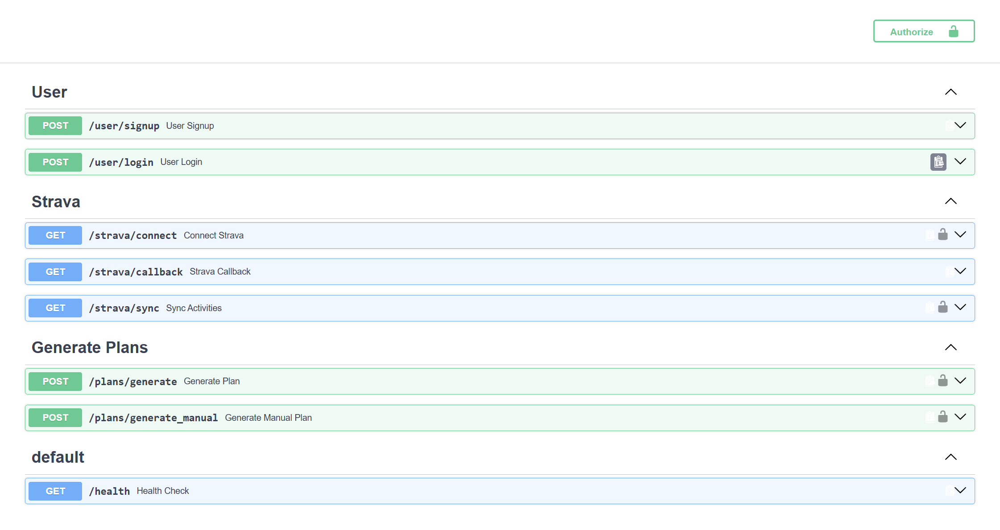
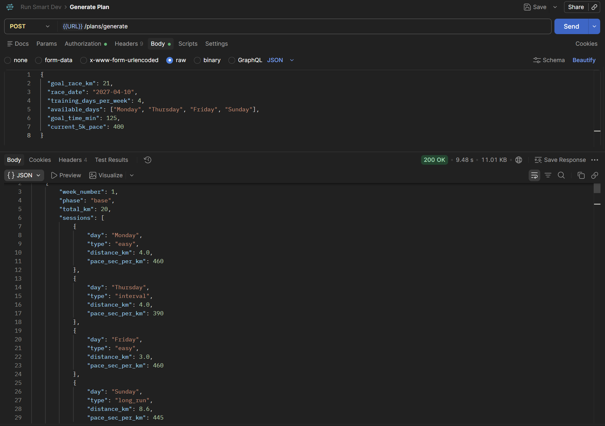
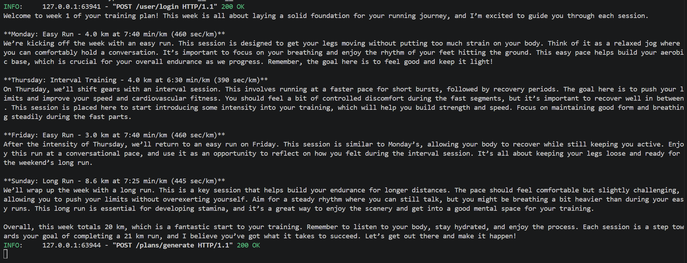

# 🏃 Run Smart

> **Train smarter, not just harder.**

Run Smart is a personalised running training platform built with **FastAPI** that generates adaptive, multi-week training plans based on a runner's goal, current fitness, available training days, and target race date.

The project combines training analytics, personalised plan generation, Strava activity ingestion, and AI-powered workout explanations to create a personalised training experience.

🔗 **Repository:** https://github.com/DavidDC0de/Run-Smart

---

## 📸 Screenshots


### API Documentation



### Personalised Training Plan



### AI Workout Explanation



---

# 🚀 Features

## 📊 Training Analytics

Run Smart can connect to the **Strava API** using OAuth 2.0 and ingest historical running activities.

The ingestion pipeline processes up to **100 historical activities per user** and extracts training metrics including:

* Distance
* Pace
* Heart rate
* Heart rate zones
* Training load
* Activity history

Data is stored in a **normalised PostgreSQL schema**, allowing training history and performance metrics to be analysed efficiently.

Users without Strava can also provide their running information manually.

---

## 🗓️ Adaptive Training Plan Generator

The core feature of Run Smart is a personalised training plan generator.

Users can customise inputs including:

* 🏁 Goal race distance
* 📅 Race date
* 🎯 Goal finishing time
* 🏃 Current running pace
* 📆 Training days per week
* 📍 Specific days available for training

The generator uses these inputs to calculate a personalised training plan that adapts to the user's requirements.

### Example Input

```json
{
  "goal_race_km": 21,
  "race_date": "2027-04-10",
  "training_days_per_week": 4,
  "available_days": [
    "Monday",
    "Thursday",
    "Friday",
    "Sunday"
  ],
  "goal_time_min": 125,
  "current_5k_pace": 400
}
```

The training programme is built around the runner's:

* Current fitness level
* Target race distance
* Available preparation time
* Goal race pace
* Weekly availability

Changing the **race distance, race date, goal time, current pace, or available training days** produces a different training programme tailored to the user.

---

# 🧠 Training Periodisation

Training plans are periodised across multiple phases:

```text
Base → Build → Race-Specific → Taper
```

### Base Phase

Focuses on:

* Building aerobic capacity
* Establishing consistent weekly mileage
* Developing endurance
* Gradually increasing long-run distance

### Build Phase

Introduces:

* Higher weekly training volume
* Tempo sessions
* Interval sessions
* Longer endurance runs
* Increased training load

### Race-Specific Phase

Focuses on preparing the runner for the demands of their specific race distance and target pace.

### Taper Phase

Reduces training volume while maintaining some intensity to help the runner arrive at race day recovered and prepared.

---

# 📈 Example Generated Training Plan

Using the example input above, Run Smart generates a **31-week personalised half-marathon training plan**.

## Week 1 — Base Phase

**Total distance: 20 km**

| Day      | Session  | Distance | Target Pace |
| -------- | -------- | -------: | ----------: |
| Monday   | Easy Run |   4.0 km | 7:40 min/km |
| Thursday | Interval |   4.0 km | 6:30 min/km |
| Friday   | Easy Run |   3.0 km | 7:40 min/km |
| Sunday   | Long Run |   8.6 km | 7:25 min/km |

### API Response

```json
{
  "week_number": 1,
  "phase": "base",
  "total_km": 20,
  "sessions": [
    {
      "day": "Monday",
      "type": "easy",
      "distance_km": 4.0,
      "pace_sec_per_km": 460
    },
    {
      "day": "Thursday",
      "type": "interval",
      "distance_km": 4.0,
      "pace_sec_per_km": 390
    },
    {
      "day": "Friday",
      "type": "easy",
      "distance_km": 3.0,
      "pace_sec_per_km": 460
    },
    {
      "day": "Sunday",
      "type": "long_run",
      "distance_km": 8.6,
      "pace_sec_per_km": 445
    }
  ]
}
```

---


# 🤖 AI-Powered Workout Explanations

Run Smart integrates the **OpenAI API** to generate natural-language explanations for each week of training.

Rather than only returning structured JSON, the application can explain:

* The purpose of each workout
* How hard the session should feel
* What the runner should focus on
* Why the workout is included
* How the session contributes to the overall race goal

AI explanations are generated **one week at a time**, providing guidance for every session.

### Example — Week 1

**Monday — Easy Run**

> Run at a relaxed, conversational pace. The goal is to build your aerobic base while allowing your body to adapt to consistent training.

**Thursday — Interval Training**

> Faster running segments are used to improve speed and endurance. The session should feel challenging while allowing you to maintain good running form.

**Friday — Easy Run**

> A lower-intensity session designed to maintain mileage while helping the body recover from the previous quality workout.

**Sunday — Long Run**

> The long run builds endurance and prepares the runner for the demands of the target race distance.

---

# 🏃 Strava Integration

Run Smart integrates with the **Strava API** using OAuth 2.0.

The workflow allows users to:

```text
Connect Strava
      ↓
Authorise Application
      ↓
Retrieve Activity History
      ↓
Process Running Activities
      ↓
Calculate Training Metrics
      ↓
Generate Personalised Training Data
```

Up to **100 historical activities** can be processed for each user.

The processed data can include:

* Distance
* Pace
* Heart rate
* Heart rate zones
* Training load

Users who do not use Strava can still generate plans through manual input.

---

# 🔐 Authentication

The API includes secure authentication using:

* JWT authentication
* Password hashing with bcrypt
* Protected API routes

Users can securely create accounts, authenticate, and access their training data and personalised plans.

---

# 🗄️ Database

Training data is stored in a normalised PostgreSQL database.

The backend uses:

* PostgreSQL
* SQLAlchemy ORM
* Alembic migrations

The database supports relationships between:

* Users
* Authentication data
* Strava connections
* Running activities
* Training metrics
* Generated training plans
* Weekly sessions

---

# 🛠️ Tech Stack

### Backend

* Python
* FastAPI

### Database

* PostgreSQL
* SQLAlchemy
* Alembic

### Authentication & Security

* JWT
* bcrypt
* OAuth 2.0

### APIs

* Strava API
* OpenAI API

### Development & Infrastructure

* Docker
* Dockerised PostgreSQL
* pytest
* GitHub Actions
* Swagger / OpenAPI documentation

---

# 🏗️ Project Architecture

```text
                        ┌─────────────────┐
                        │     Client      │
                        └────────┬────────┘
                                 │
                                 ▼
                        ┌─────────────────┐
                        │     FastAPI     │
                        │       API       │
                        └────────┬────────┘
                                 │
              ┌──────────────────┼──────────────────┐
              ▼                  ▼                  ▼
     ┌────────────────┐ ┌────────────────┐ ┌────────────────┐
     │ Authentication │ │ Training Plans │ │ Strava OAuth   │
     │ JWT + bcrypt   │ │ Generator      │ │ Integration    │
     └────────────────┘ └────────────────┘ └────────────────┘
              │                  │                  │
              └──────────────────┼──────────────────┘
                                 │
                                 ▼
                        ┌─────────────────┐
                        │   PostgreSQL    │
                        │  SQLAlchemy ORM │
                        └─────────────────┘
                                 │
                                 ▼
                        ┌─────────────────┐
                        │ Training Data & │
                        │ Activity Metrics│
                        └─────────────────┘
```

---

# 📚 API Documentation

FastAPI provides interactive Swagger/OpenAPI documentation.

Once the application is running, API documentation is available at:

```text
/docs
```

The documentation allows API endpoints to be explored and tested directly from the browser.

---

# 🐳 Getting Started

## Clone the Repository

```bash
git clone https://github.com/DavidDC0de/Run-Smart.git
cd Run-Smart
```

## Configure Environment Variables

Create a `.env` file:

```env
DATABASE_URL=

JWT_SECRET_KEY=

STRAVA_CLIENT_ID=
STRAVA_CLIENT_SECRET=
STRAVA_REDIRECT_URI=

OPENAI_API_KEY=
```

> Never commit API keys, secrets, or production credentials.

---

## Start PostgreSQL with Docker

```bash
docker compose up -d
```

## Run Database Migrations

```bash
alembic upgrade head
```

## Start the API

```bash
uvicorn app.main:app --reload
```

The API should now be running locally.

---

# 🧪 Testing

The project is actively expanding test coverage using `pytest`.

Testing focuses on:

* Training plan generation
* Pace calculations
* Training progression
* API endpoints
* Authentication
* Data ingestion

GitHub Actions CI is also being added to automate testing on repository changes.

---

# 🎯 Personalisation

A core goal of Run Smart is to avoid a **one-size-fits-all training programme**.

The generated training plan changes depending on the user's inputs.

```text
Race Distance
      +
Race Date
      +
Goal Time
      +
Current Running Pace
      +
Training Days Per Week
      +
Available Days
      ↓
Personalised Training Plan
```

A runner can adjust their goal, schedule, and current ability, and the programme is generated accordingly.

For example, changing any of the following will affect the structure of the plan:

* Running a different race distance
* Having more or less time before race day
* Training on different days
* Running more or fewer days per week
* Having a different current fitness level
* Targeting a different finishing time

The result is a training programme built around the runner's **goal, fitness, and schedule**.

---

# 🔮 Future Development

Planned and ongoing improvements include:

* Increased pytest coverage
* GitHub Actions CI
* More advanced fitness scoring
* Additional training metrics
* Improved adaptive plan adjustments
* Expanded Strava analytics
* Enhanced AI coaching explanations
* Additional race distances and training configurations

---

# 💡 Motivation

Run Smart was built as a personal project combining backend engineering with an interest in endurance training.

The project explores how structured running data, training principles, external APIs, and AI can be combined to generate personalised training programmes.

Rather than returning a static training plan, Run Smart aims to adapt the programme around the individual runner.

> **Your goal. Your pace. Your schedule. Your plan.**

---

# 👨‍💻 Author

**David**

🔗 https://github.com/DavidDC0de

---

⭐ If you find the project interesting, consider starring the repository!
